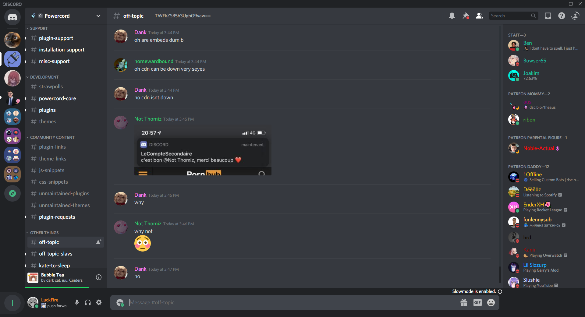

<p align="center">
  <a href="#">
  <a href="https://github.com/LuckFire/BottomBar/stargazers"></a>
</p>

# Bottom Bar for Revert Discord
A nice, simple looking, bottom bar. Fixed for Revert Discord. Inspired by CapnKitten's Spotify Discord theme.


## Installation
For Powercord or Vizality installation, go to  **your themes folder, open a command prompt / powershell / terminal / or git bash**  and enter the following:
```
git clone --single-branch --branch revert-discord https://github.com/LuckFire/BottomBar
```

## Updating for Powercord
Powercords updater is currently broken, so in order to update the theme you will have to do it manually. To do it manually, go to **Themes -> BottomBar -> Open CMD / Powershell / Terminal / Gitbash**, and enter the following:
```
git pull
```

## Credits 
Thank you to Hoofer for helping me get the bottom area below the members list colored as well as finding multiple issues because I am super stupid.
